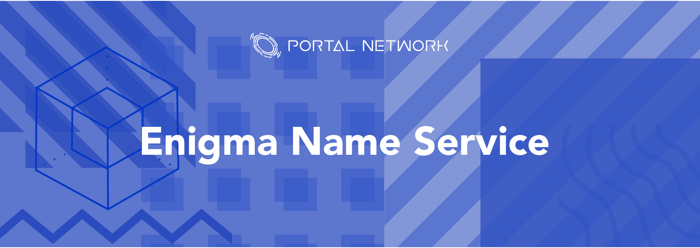

> 📖🔍 Documents of the Enigma Name Service.

## 💡 What is Enigma?
Enigma is an off-chain network meant to complement blockchain networks by providing secondary-layer data storage and computation.  The protocol will offer privacy and scaling solutions to any blockchain program that uses it, as data offloaded onto the Enigma network will be both private and freed from on-chain network congestion.

## 💡 What is BNS?
BNS – or blockchain name system – is the protocol on the internet that turns human-comprehensible decentralized website names such as ‘website.eng’ or ‘mywebsite.eth’ into addresses understandable by decentralized network machines.

## 📝 Description

ENGNS is the Enigma Name Service, a distributed, open, and extensible naming system based on the Enigma blockchain.

## 📚 Documents

#### Table of Contents
- [Introduction](./docs/INTRODUCTION.md)
- [Implementation](./docs/IMPLEMENTATION.md)
    - [Registry](./docs/REGISTRY.md)
    - [Registrar](./docs/REGISTRAR.md)
    - [Resolver](./docs/RESOLVER.md)
- [Integration](./docs/INTEGRATION.md)
- [Tutorial](./docs/tutorial/)

## 📝 Guideline
- [Smart Contract Testing](./engns/README.md)

## 🗃 Changelog
See [CHANGELOG.md](./CHANGELOG.md).

## 📣 Contributing
See [CONTRIBUTING.md](./CONTRIBUTING.md) for how to help out.

## 🗒 Licence
See [LICENSE](./LICENSE) for details.
