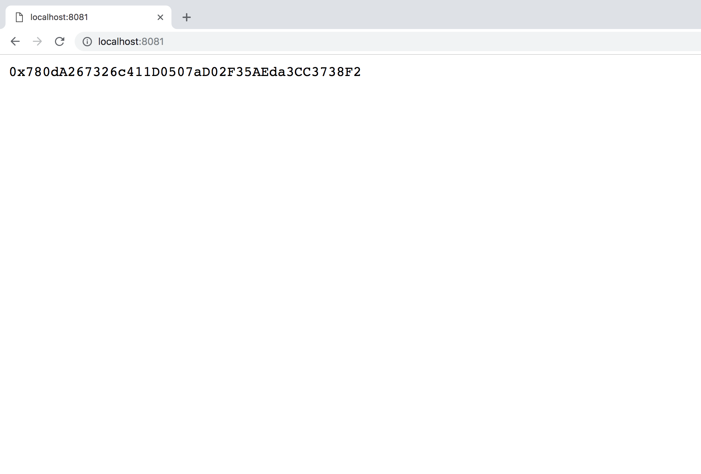
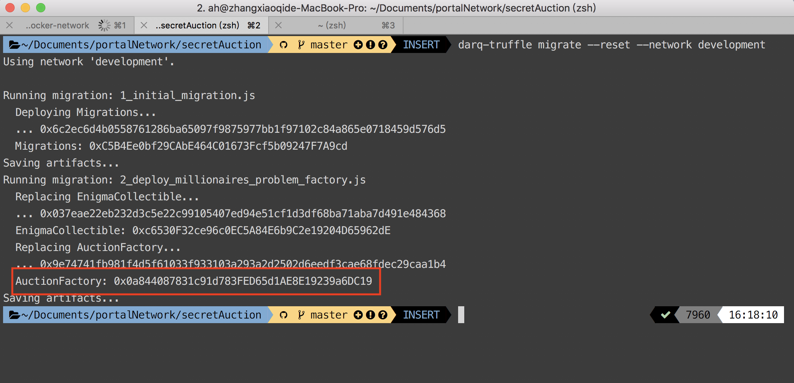
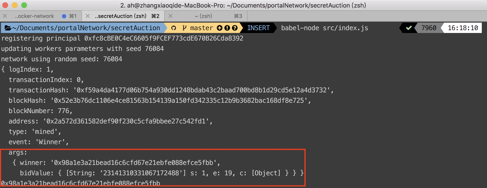

# Secret Auction

It's a demo of enigma's secret auction, you can find source code of [SecretAuction](https://github.com/enigmampc/secret-contracts/blob/master/contracts/) and [enigma-utli](https://github.com/enigmampc/enigma-template-dapp/blob/master/client/src/lib/enigma-utils.js) on their official github repository. 

## Prerequisite

Clone the sample code [here](https://github.com/PortalNetwork/Secret-Auction-Demo)
```
git clone https://github.com/PortalNetwork/Secret-Auction-Demo.git
```

Enigma testnet deployed. If you don't have it yet, refer to [here](./enigma-docker-network.md).
## Installation

Install all the dependency module:
```
cd Secret-Auction-Demo
npm i
npm i -g babel-cli
npm i -g darq-truffle@next
cd src
npm i
```

## Breaking down the smart contract
For secret bid demo, we add some code snippets into the `Auction.sol`
Let's take a look at `Secret-Auction-Demo/contracts/Auction.sol`:

- `Line 74-83`:
```js
  function bid(bytes _bidValue) external {
    require(now < endTime);  
    require(stakeAmounts[msg.sender] >= startingPrice); 
    bidders[msg.sender].bidValue = _bidValue;
    if (!(bidders[msg.sender].hasBidded)) {
      bidders[msg.sender].hasBidded = true;
      bidderAddresses.push(msg.sender);// For the highest bidder computing
    }
    emit Bid(_bidValue);
  }
```
We use `bidderAddresses` to store all the bidder addresses.

- `Line 183-185`:
```js
  function getBidders() public view returns (address[]) {
    return bidderAddresses;
  }
```
We use `getBidders` to get all the bidder addresses.

## Deploy secret contracts

First we need to deploy `AuctionFactory.sol`, in `Secret-Auction-Demo/migrations/2_deploy_millionaires_problem_factory.js`:

```js
var EnigmaCollectible = artifacts.require("./EnigmaCollectible.sol");
var AuctionFactory = artifacts.require("./AuctionFactory.sol");

module.exports = function(deployer) {
  const enigmaAddr = "0x780dA267326c411D0507aD02F35AEda3CC3738F2"; // Replace it with your own address
  deployer.deploy(EnigmaCollectible, "ENG721", "E721").then(function() {
    return deployer.deploy(AuctionFactory, enigmaAddr, EnigmaCollectible.address);
  });
};
```
- `enigmaAddr`: You should replace it with your own enigma contract address, obtain the Enigma contract address hosted at your `localhost:8081` after you boot up the [testnet](./enigma-docker-network.md). Just access `localhost:8081` in your browser:


After replacement of the Enigma contract address, type in:
```
darq-truffle migrate --reset --network development
```

You can find the deployed contract address in:


In `Secret-Auction-Demo/src/index.js`:
- `Line 29`:
```js
// Replace it with the actual auctionFactory contract address
const auctionFactoryContractAddress = "0x9BA12813B7Cc2E645193e9BD19Cfeb7d7277b8F0";
```

## Demo

In the demo of secret auction:

1. Create a new auction and get the auction contract address.
```js
// Create new auction with expired time(in seconds) and starting price(in wei)
await auctionFactory.createAuction(864000, 500000,{
	from: accounts[0],
	gas: GAS
});
// Get the auction contract address
const addr = await auctionFactory.getAuctionAddresses({
	from: accounts[0],
	gas: GAS
});
// Always use the latest auction address
const auctionAddress = addr[addr.length -1];
// Initialize contract instance to call contract later
const auction = await getContractInstance(
	web3,
	auctionContractDefinition,
	auctionAddress
);
```

2. We need to first stake some tokens(>= starting price) in the contract.
```js
// Bidders must stake tokens first which is greater than or equal to starting price  
await auction.stake({
	from: accounts[0],
	gas: GAS,
	value: web3.utils.toWei("8000000","wei")
});
await auction.stake({
	from: accounts[1],
	gas: GAS,
	value: web3.utils.toWei("9000000","wei")
});
```

3. Starting bid with the price you can offer, and the bid value is encrypted.
```js
// Bid value must be less than stake value and be encrypted
let bidVal = await getEncryptedValue("1000000");
await auction.bid(bidVal, {
	from: accounts[0],
	gas: GAS
});
bidVal = await getEncryptedValue("2000000");
await auction.bid(bidVal,{
	from: accounts[1],
	gas: GAS
});
```

4. Create a enigma task to compute the highest bidder:
- Enigma task will be submitted to enigma network to calculate the auction winner. It will execute `callable` and `callback` function in the auction contract.
	```js
	/*
	* The callable function. Gets the highest bidder and bid amount for the auction.
	*/

	function getHighestBidder(address[] _bidders, uint[] _bidAmounts, uint[] _stakeAmounts) public pure returns (address, uint) {
		address highestBidder;
		uint highestBidAmount;
		for (uint i = 0; i < _bidders.length; i++) {
			if ((_bidAmounts[i] > highestBidAmount) && (_bidAmounts[i] <= _stakeAmounts[i])) {
				highestBidAmount = _bidAmounts[i];
				highestBidder = _bidders[i];
			}
		}
		return (highestBidder, highestBidAmount);
	}

	/*
	* The callback function. Updates the contract state.
	*/

	function updateWinner(address _highestBidder, uint _highestBidAmount) public
	{
		winner = _highestBidder;
		winningPrice = _highestBidAmount;
		state = AuctionState.COMPLETED;
		stakeAmounts[_highestBidder] -= winningPrice;
		emit Winner(_highestBidder, _highestBidAmount);
	}
	``` 
	The `callable` function in the demo is `getHighestBidder`, and its parameters are:
	- `_bidders`: set of all bidders' address
	- `_bidAmounts`: encrypted bid value of all bidders
	- `_stakeAmounts`: encrypted stake value of all bidders

	So, we need to pass the arguments to Enigma task:
	```js
	const bidders = await auction.getBidders();
	let stakeAmounts = [];
	let bidValue = [];

	for(let i = 0; i < bidders.length; i++){
		let bidVal = await auction.getBidValueForBidder(bidders[i], {
			from: accounts[0],
			gas: GAS
		});
		let stakeAmount = await auction.getStakeOfBidder(bidders[i], {
			from: accounts[0],
			gas: GAS
		});
		bidValue.push(bidVal);
		stakeAmounts.push(await getEncryptedValue(stakeAmount.toNumber().toString()));
	}

	let blockNumber = await enigmaSetup.web3.eth.getBlockNumber();
	/*
	Take special note of the arguments passed in here (blockNumber, dappContractAddress,
	callable, callableArgs, callback, fee, preprocessors). This is the critical step for how
	you run the secure computation from your front-end!!!
	*/
	let task = await enigmaSetup.enigma.createTask(
		blockNumber,
		auctionAddress,
		CALLABLE,
		[bidders, bidValue, stakeAmounts],//arguments of callable function
		CALLBACK,
		ENG_FEE,
		[]
	);
	```

	Lastly, send task to enigma network:
	```js
	let resultFee = await task.approveFee({
		from: accounts[0],
		gas: GAS
	});
	let result = await task.compute({
		from: accounts[0],
		gas: GAS
	});
  ```

	We can listen the event to get final winner of the auction:

	```js
	const callbackFinishedEvent = auction.Winner();
	callbackFinishedEvent.watch(async (err, res)=>{
		if(!err){
			console.log(res);
			console.log(await auction.getWinner());
			callbackFinishedEvent.stopWatching((err, res)=> {
				if(err){
					console.log(err);
				}
			});
		}else{
			console.log(err);
		}
	});
	```
	

## Reference
[secret auction walkthrough](https://blog.enigma.co/secret-auction-smart-contracts-with-enigma-a-walkthrough-ec27f89f9f7c)
[enigma doc](https://enigma.co/protocol/SecretContracts.html#example-02-secret-auctions)
