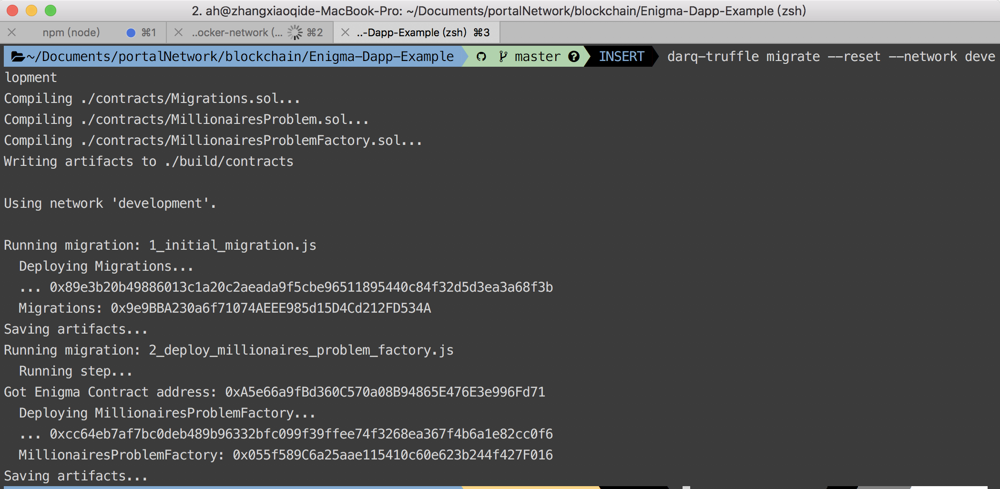
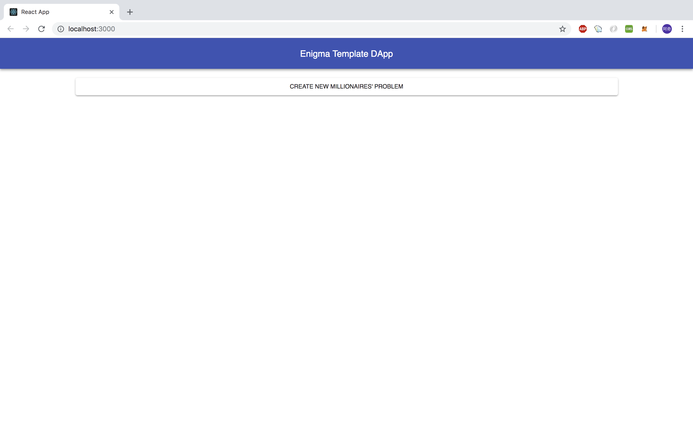
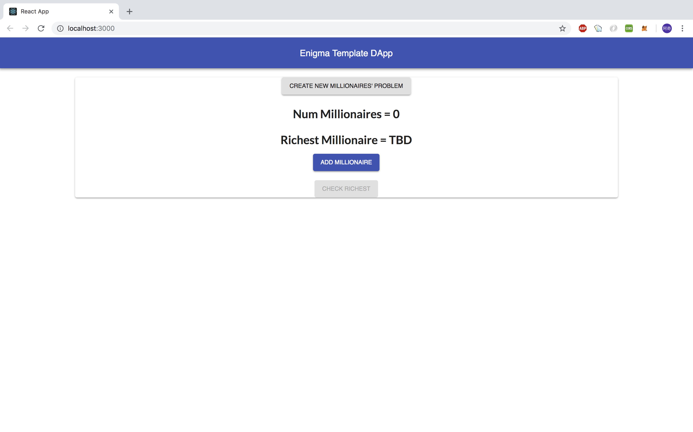
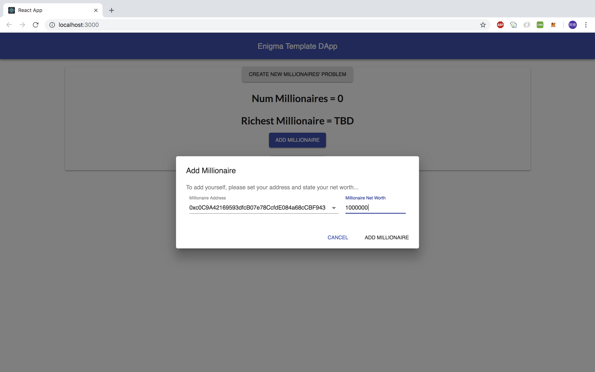
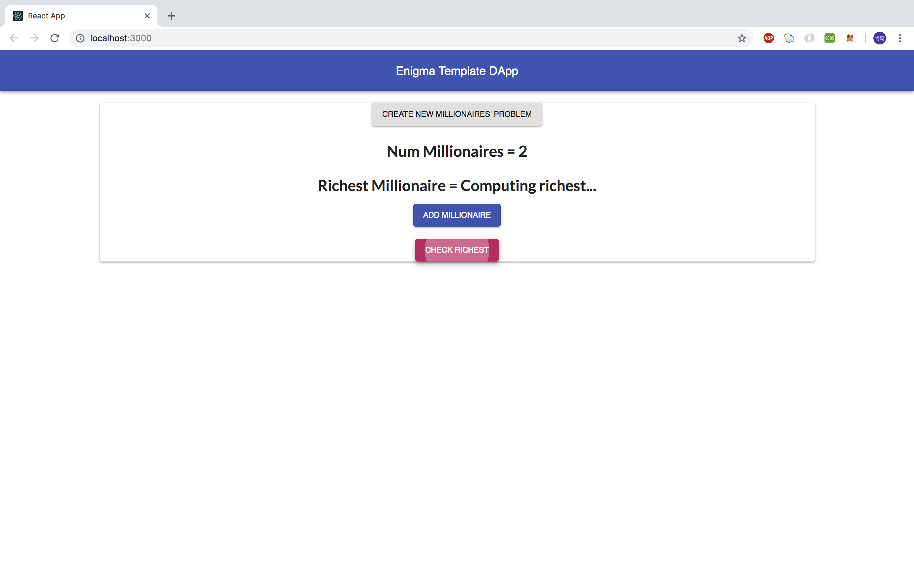
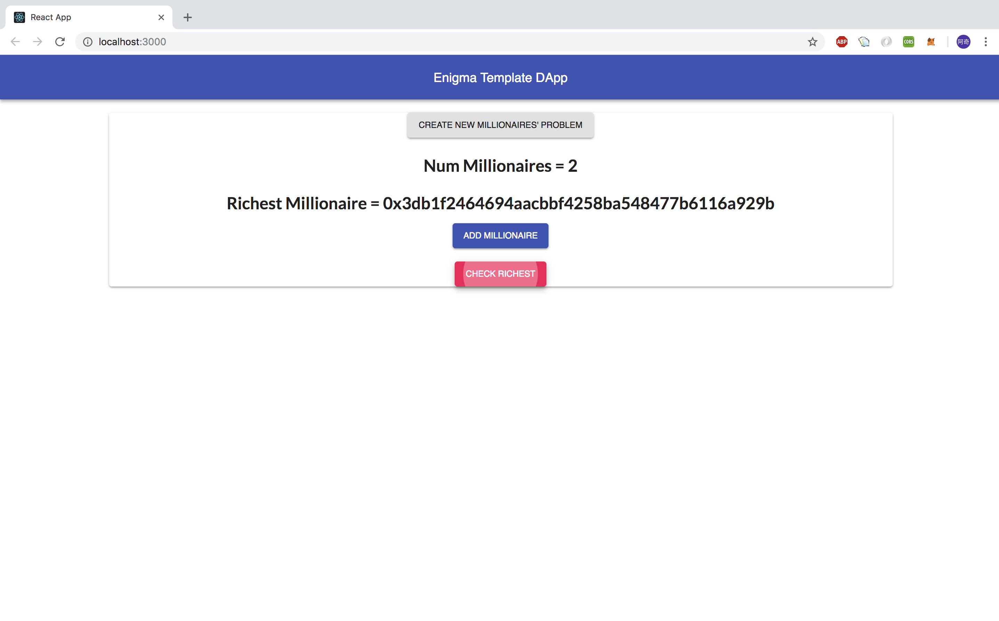

# Enigma Protocol

to an off-chain network
Enigma is aiming to build the first platform for scalable, privacy-preserving smart contracts, which will enable end-to-end decentralized applications. The protocol will offer privacy and scaling solutions through connecting to an existing blockchain and off-load private and intensive computations. It introduces a concept of `Zero-knowledge proof` on their `Secret-Contract` to do private computaions.

- `Zero-knowledge proof` :  a zero-knowledge proof or zero-knowledge protocol is a method by which one party (the prover Peggy) can prove to another party (the verifier Victor) that she knows a value x, without conveying any information apart from the fact that she knows the value x. ([reference](https://en.wikipedia.org/wiki/Zero-knowledge_proof))

## Secret Contract

You can view secret contracts as normal smart contracts which ensure data privacy. To achieve this goal, Enigma supports two main features `MPC` and `DHT`.

- `MPC` : which means secure multiparty computations. It's responsible for distributing encrypted data among nodes on the network.
- `DHT` : abbreviation of `distributed hash-table`. It's in charge of storing encrypted data in an off-chain database.  

In general, MPCs are responsible for handling and retrieving the data which is stored in DHT.

## Example of dApp that interacts with the secret contract

The following is a walkthrough of building a dApp that interacts with the secret contract. We will use the sample project from [Enigma official](https://github.com/enigmampc/enigma-template-dapp), within it you can find all the code snippets used in this example. For demonstration, I put all things together in this [project](https://github.com/PortalNetwork/Enigma-Dapp-Example). Here is requirement of this dApp demo:

- Enigma testnet deployed. If you don't have it yet, reference [here](./enigma-docker-network.md).
- Example project cloned: 
```
git clone https://github.com/PortalNetwork/Enigma-Dapp-Example
```

### Let's start

1. In the just cloned project directory, install all the dependency package:
    ```
    cd Enigma-Dapp-Example
    npm i
    ```
    Also enter into the `client/` folder, and install all the dependency package:
    ```
    cd client
    npm i
    ```

    Finally, install the package necessary to compile the smart contracts:
    ```
    npm install -g darq-truffle@next
    ```

2. Now, we can compile and deploy the secret contract to local testnet.
    ```
    darq-truffle migrate --reset --network development
    ```
    Note: Ensure your local testnet is alive.



3. Open front-end page to check if your contract deployment succeeded:
    ```
    npm run start
    ```
    You will see:



4. You can try out the dApp. This dApp is used to solve [Millionaire's problem](https://en.wikipedia.org/wiki/Yao%27s_Millionaires%27_Problem)



    Add many millionaires with different property values as you want:


    Check who is the richest of all millionaires, it will call the secret contract to figure out the richest one.




The above is just a brief demo of Enigma's template dApp. For further explanation of secret contract content, you can referenct [Enigma's doc](https://enigma.co/protocol/SecretContracts.html).

## Reference
- [Enigma-dApp-template](https://github.com/enigmampc/enigma-template-dapp)
- [sample secret contract](https://enigma.co/protocol/SecretContracts.html)
- [Tutorial](https://blog.enigma.co/getting-started-with-the-enigma-protocol-a-complete-developers-guide-170b7dfa5c0f)