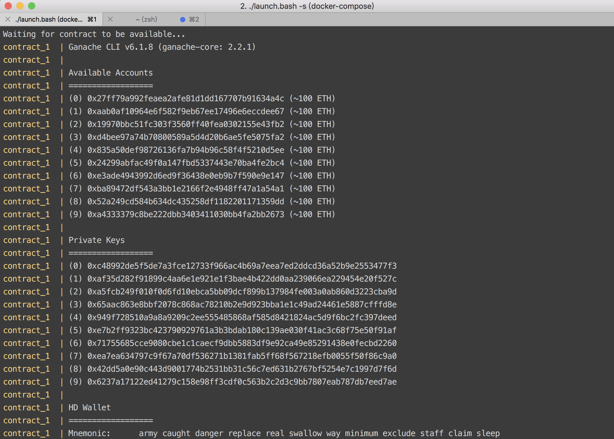
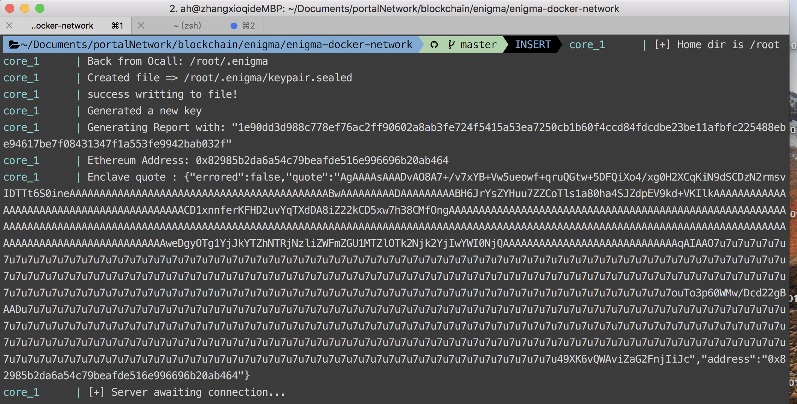
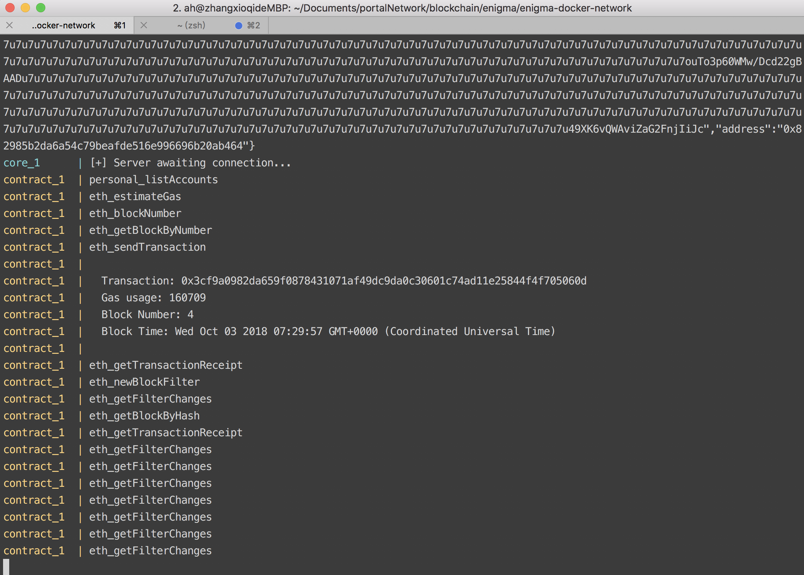

# Introduction

The Enigma protocol is a decentralized and distributed network of servers around the world (known as ‘nodes’) which, through the use of secret contracts, are able to compute data in a way that maintains confidentiality and integrity.

This local testnet is an entirely `self-contained` network (deployed using Docker) which is intended to let developers have a chance to build their first secret contracts and learn how Enigma’s components operate. We will briefly describe how to deploy Enigma Testnet on your own local machine.

## Requirement

There are two modes of running the entire network, hardware mode and software mode. The main difference between these two modes is that with hardware mode Enigma can provide an additional layer of integrated security at the hardware level. Utilizing `hardware mode` requires a machine with a CPU that is enabled for Intel Software Guard Extensions.

We will use software mode to host the local testnet, the following is system requirement of software mode:

- A GNU/Linux distribution
- The latest Docker release
- The latest Docker Compose release
- The `npm`, `scrypt`, `nodejs` and `node`-gyp packages installed

## Setting up the local testnet

1. Clone the [enigma-docker-network](https://github.com/enigmampc/enigma-docker-network) project and change to the directory just cloned.
```
git clone https://github.com/enigmampc/enigma-docker-network.git
cd enigma-docker-network
```

2. Enigma officially provides a script of setting up local testnet. It will automatically download all the necessary packages, setting up testnet and deploying default contracts within it. Execute the command:
```
./launch.bash -t -s
```

Stop Enigma docker
```
./launch.bash -q
```

- `-t` : Spawn a terminal for every container/process. It's optional. You need to have xterm installed. Comes by default in Linux distributions. In MacOS, you need to install [XQuartz](https://www.xquartz.org/).
- `-s` : Run in simulation mode. It's necessary for running the `software mode`

As you can see, it deploys a private network on localhost like [ganache-cli](https://github.com/trufflesuite/ganache-cli).




## Reference

- [Enigma-Doc](http://enigma.co/protocol/index.html)
- [enigma-docker-network repo](https://github.com/enigmampc/enigma-docker-network)
